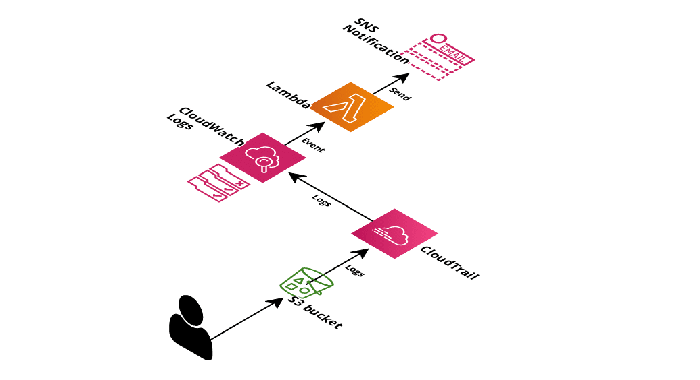

# Audit S3

This is a terraform code to deploy the necessary infrastructure to identify unauthorized activity to a S3 bucket.



Deployment details can be found here: https://attackiq.com/blog/2020/04/14/defeating-a-cloud-breach-part-3/

Notifications will be send by email using the SNS service. An email subscription to the SNS topic is needed once the TF is deployed.

## Deploy

```
# terraform apply
```

Variables needed:
* monitored_bucket: Bucket name to monitor
* name: Solution name. This value is used when naming resources.

